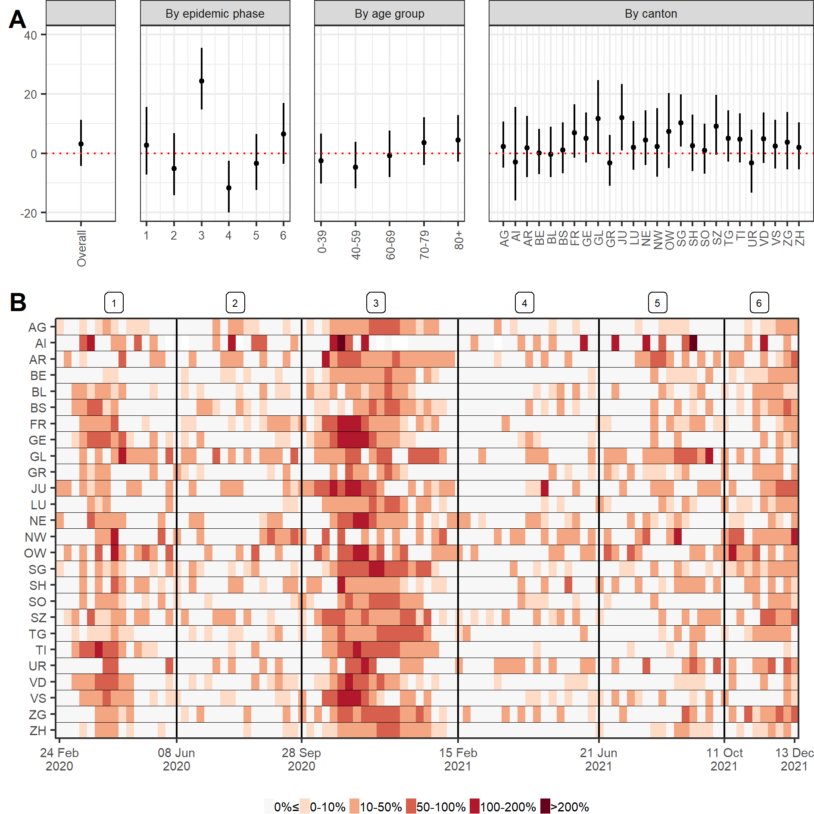

```{r setup, include=FALSE}
source("main.R")
table1 = da_406_format_table(summ_all_base,summ_regbma2)
```

# Introduction

There are two main approaches to quantifying the impact of SARS-CoV-2 infection in a population in terms of mortality. 
The first approach relies upon the reporting of laboratory-confirmed deaths, i.e. deaths of people with a recent confirmed positive RT-PCR or rapid antigen test.
This has the advantage of being available in real-time, nevertheless depends on the quality and comprehensiveness of the country's deaths registration system and on the testing availability. It is therefore not exhaustive, as some deaths will remain unascertained because of a lack of test (e.g. because of test shortages or overwhelmed health systems) [@li2020researchfactors]. Laboratory-confirmed deaths also do not include deaths that have been indirectly caused (or averted) by the SARS-CoV-2 pandemic, e.g. in consequence of control measures. The second approach is based on excess mortality, and relies upon all-cause mortality data and counter-factual reasoning.
The idea is to compare the observed number of deaths to what would have been expected had the SARS-CoV-2 pandemic not occurred, based on mortality data from the previous years,  population changes and a set of covariates. Excess mortality has the advantage of summing all the negative and positive effects of the occurrence of SARS-CoV-2 on mortality, at the cost of not being able to disentangle them [@wang2022estimating]. It is also highly dependent on model assumptions and methodological choices, such as for instance age-specific population trends [@de2022assessing]. In this nationwide study in Switzerland until January 2022, we aimed to characterize the similarities and discrepancies between laboratory-confirmed SARS-CoV-2-related deaths and excess mortality by time period, location and age group. We additionally propose an approach to decompose all cause deaths into laboratory confirmed COVID-19 deaths and deaths expected had the pandemic not occurred to evaluated case ascertainment and the indirect impact of the pandemic in all-cause deaths.


# Methods

## Data 

### Prediction model
We retrieved population estimates for the years 2014-2019 from the Federal Statistical Office in Switzerland. Estimates are available for the 31st of December of each year. To calculate populations at the 31st of December in 2020 and 2021 under the counterfactual scenario that the pandemic did not occur, we performed a two-stage linear interpolation as explained previously [@konstantinoudis2022regional]. Briefly, we based on the 31st of December of years 2014-2019 and a linear regression model, we predicted the 31st of December of years 2020, 2021 and 2022, by age, sex, and canton. Then we calculated weekly population counts  by age, sex, and canton by linearly interpolating the estimates of 31st of December of the consequent years. To help predictions we incorporated covariates related with ambient temperature and national holidays. Daily mean ambient temperature during 2014 and 2021 at 1km grid was retrieved from the MeteoSwiss and aggregated by taking means per week and canton. National holidays were considered as dummy variables, and defined on a weekly basis for each canton, being 1 if there was at least 1 cantonal holiday in that week. 

### Decomposition model
The declaration of laboratory-confirmed SARS-CoV-2-related deaths has been mandatory in Switzerland since February 2020. 
All collected data are centralized at the Federal Office of Public Health [REF].
Case definition (...).
Available information include age, sex, canton of residence, and the date and type of the positive SARS-CoV-2 test.
Individual data on all deaths occurring in Switzerland from death certificates are collected by the Federal Office of Statistics [REF]. 
Information include (...).
Details about the cause of death as listed in the death certificate are encoded with a delay of several months and were not available for this analysis.

## Statistical methods 
### Prediction model
We estimated the expected number of all-cause deaths for each week between `r format(min(date_phases$start_date),"%d %B %Y")` and `r format(max(date_phases$end_date),"%d %B %Y")`by age, sex and canton of residence using historical data (2014-2019) and expanding a previously proposed model [@konstantinoudis2022regional]. Briefly, we used Bayesian spatio-temporal models accounting for population trends and including covariates related with temperature and national holidays. Since the effect of temperature on all-cause mortality is expected to be U-shaped, we used a random walk of order 2 to allow flexible fits. We accounted for seasonality using a random walk of order 1 at the weekly level, long term trend using a white noise process at the yearly level and for spatial autocorrelation using conditional autoregressive priors. In particular, we modeled spatial autocorrelation using an extension of the BYM model, allowing for a mixing parameter which measures the proportion of the marginal variance explained by the spatial autocorrelation term (citation). We fitted the model independently for the selected age and sex groups and using the entire posterior distribution of the expected deaths we retrieved estimates at any different aggregation desired [@konstantinoudis2022framework]. The model has been internally validated and found to have high predictive accuracy in the older groups, whereas the results were less reliable in for people $40<$ years old [@konstantinoudis2022regional].


### Decomposition model

We developed a method to decompose the observed all-cause deaths into 1) the number that can be expected given historical trends and 2) the number of deaths attributed to SARS-CoV-2.
We used a Poisson regression model with an identity link and no intercept therm of the form:
$$
\text{O}_{t} \sim \text{Poisson}\left( \beta_1\text{L}_{t} + \beta_2\text{E}_{t} \right),
$$
where $\text{O}_{t}$ is the observed number of all-cause deaths on week $t$, $\text{L}_{t}$ is the number of laboratory-confirmed SARS-CoV-2-related deaths, and $\text{E}_{t}$ is the expected number of all-cause deaths given historical trends.


Within this formulation, $\beta_1$ is the number of all-cause deaths for each unit increase in laboratory-confirmed deaths, after adjusting for the expected number of all-cause deaths given historical trends. That means that under perfect case ascertainment $\beta_1=1$. If $\beta_1>1$, then we observe a greater number of deaths attributed to SARS-CoV-2 infections compared with the number of laboratory-confirmed deaths. The ascertainment proportion of SARS-CoV-2-related deaths is obtained by $1/\beta_1$. This relies on the assumption that when there is at least one laboratory-confirmed death in a given week, then the excess in observed all-cause deaths can be directly attributed to SARS-CoV-2. In a similar way, $\beta_2$ is the number of all-cause deaths for each unit increase in the expected number of all-cause deaths, after adjusting for the direct effect of SARS-CoV-2. We expect $\beta_2=1$ when the net effect of the pandemic-related behavioral, societal and health system changes on all-cause deaths is zero. The estimate of $\beta_2$ can thus be interpreted as a measure of the indirect effect of the pandemic on mortality. If $\beta_2<1$, then there were fewer all-cause deaths than expected after removing the direct effect of SARS-CoV-2, which implies an indirect protective effect of all changes and control measures associated with the pandemic.

# Results

Figure 1, panel A shows the weekly relative excess mortality by canton during 24 of February 2020 and 13 of December 2021. It seems that phase 3 was the period when Switzerland was hit the most, with the relative excess in several cantons being between 100-200%. The canton with the highest relative excess was the canton of Appenzell Innerrhoden, but this just reflects the small number of expected deaths in this canton leading to unstable estimates, Figure 1. Figure 2, panel B shows the posterior probability that the relative excess is higher than 0 during the 6 phases considered. During the first phase the areas hit the most were the ones near the borders with France and Italy, whereas during the third phase of the pandemic in Switzerland, the effect of the pandemic on all cause mortality was homogeneous nationwide, reflecting that the virus was no longer exogenous as it was duing phase 1. Our model reported weak if any evidence of an excess mortality duing phased 2, 4 and 5, Figure 2 panel B. 

Estimates of $\beta_1$ and $\beta_2$ provide a way to understand the interplay between laboratory-confirmed SARS-CoV-2-related deaths and excess all-cause deaths, and allow to differentiate between direct and indirect consequences of the SARS-CoV-2 pandemic. Going beyond the general case at the country level for the whole period, we extended the model presented above to examine these associations by epidemic phase (from 1 to 7 as defined by the Federal Office of Public Health, see Figure 1A), by age group (0-39, 40-59, 60-69,  70-79 and 80+), and by area (26 cantons). To this aim, we introduced multiple $\beta_1$ and $\beta_2$ for each epidemic phase, each age group or each area separately, with the additional constraint of a multilevel structure allowing a smoothing towards the global mean of the estimator [@gelman1995bayesian].

Weekly counts of laboratory-confirmed SARS-CoV-2-related deaths were aligned with estimates of excess all-cause mortality in Switzerland during most of the period (Figure 1A). 
Quantitatively, the amount of excess all-cause deaths was greater than the counts of laboratory-confirmed deaths during epidemic waves (epidemic phases 1, 3 and 6), while the reverse was true outside of epidemic waves (epidemic phases 2, 4 and 5).
This was translated into an overall estimate of $\beta_1$ of `r da_405_format_beta(summ_regbma2,select_group="Overall",select_beta="beta_1")`, 
suggesting that there were `r da_405_format_beta(summ_regbma2,select_group="Overall",select_beta="beta_1",trans="-1",digits=0)` more deaths directly attributable to SARS-CoV-2 than laboratory-confirmed deaths until January 2022 (Table 1).
Given that there have been `r table1$value[1]` laboratory-confirmed SARS-CoV-2-related deaths between February 2020 and January 2022, this implies that the total number of deaths directly attributable to SARS-CoV-2 is `r table1$value[7]`.

Conversely, the overall estimate of $\beta_2$ was `r da_405_format_beta(summ_regbma2,select_group="Overall",select_beta="beta_2")`, suggesting that there were `r da_405_format_beta(summ_regbma2,select_group="Overall",select_beta="beta_2",trans="1-",digits=0)` fewer deaths than expected during this period after adjusting for the direct effects of SARS-CoV-2. This can be explained by a combination of three different phenomena. First, the model based on historical trends may have overestimated the expected all-cause mortality, which would lead to an underestimation of $\beta_2$ but would not impact $\beta_1$. Second, it could be explained by some level of mortality displacement, whereby SARS-CoV-2 precipitated deaths that would have occurred during the period anyway. Third, the deficit could be attributed to the indirect effect of the pandemic, including prevention and control measures and a large array of changes such as reductions in mobility and traffic, social contacts and activities, or air pollution levels. 

Looking at the variation of these indicators across epidemic phases brings further insights. The number of deaths directly attributable to SARS-CoV-2 for each laboratory-confirmed deaths ($\beta_1$) was estimated around 1.5 during the first two epidemic waves (corresponding to phases 1 and 3), and higher during phases 5 and 6 suggesting an aggravation of the incompleteness of death ascertainment (Figure 1B). (DOES THIS MAKE SENSE?) The estimator is less reliable during periods where counts of laboratory-confirmed cases were low (phases 2 and 4). The number of observed all-cause deaths for each expected all-cause deaths ($\beta_2$) also varied by epidemic phase. It was comparatively lower during epidemic waves (phases 1 and 3), but also in the period following the second epidemic wave (phase 4), suggesting some level of mortality displacement.

Variation of $\beta_1$ by age group suggests that more deaths were not ascertained in age group 80+, which points toward nursing homes as the place where incomplete ascertainment occurs, confirming other reports [@li2020researchfactors]. Estimates of $\beta_2$ also show a gradient by age, with the groups most affected by SARS-CoV-2 mortality also being the ones that show a deficit of all-cause deaths, an argument in favor of mortality displacement, but also pointing towards the protective effects of the non-pharmaceutical interventions in the older age groups (for instance resulting in a lack of influenza season). Estimates by canton show generally homogeneous results for the whole of Switzerland, bringing more weight to our results. There were a few exceptions with higher estimates of $\beta_1$, potentially signaling an issue in the local reporting system.

# Discussion


**Table 1.** Summary of mortality patterns in Switzerland between February 2020 and January 2022. 

```{r}
table1 %>% 
    kableExtra::kable(col.names = c("Quantity","Value (95% uncertainty interval where applicable)")) %>% 
    kableExtra::add_footnote(c("adjusted for expected all-cause deaths","adjusted for deaths directly caused by SARS-CoV-2")) %>% 
    kableExtra::kable_paper() 
```


**Figure 1.** Excess by canton/time? Map of excess by epidemic phase?



```{r, fig.width=8,fig.height=3,fig.width=6}
da_301_summary_plot(summ_week_base)
```

**Figure 2.** Weekly counts of excess all-cause deaths (95% uncertainty intervals) and of laboratory-confirmed SARS-CoV-2-related deaths between 24 February 2020 and 23 January 2022 in Switzerland. The bar at the bottom shows the probability that excess all-cause deaths is greater than laboratory-confirmed SARS-CoV-2-related deaths (light gray is 0, black is 1). Numbers at the top indicate epidemic phases 1 to 7. 


```{r, fig.width=8,fig.height=3,fig.width=6}
da_404_plot_regbma(summ_regbma2,panel_labels = c("A","B"))
```

**Figure 3.** (A) Posterior estimates of $\beta_1$, the additional number of all-cause deaths to be observed for each unit increase in laboratory-confirmed deaths, after adjusting for the expected number of all-causes deaths given historical trends. (B) Posterior estimates of $\beta_2$, the additional number of all-cause deaths to be observed for each unit increase in the expected number of all-cause deaths, after adjusting for the direct effect of SARS-CoV-2 infections. Estimates of $\beta_1$ and $\beta_2$ are shown for the whole period, by epidemic phase (see panel A), by age group and by canton.


**References**